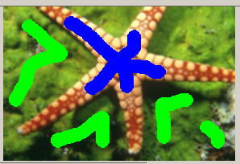
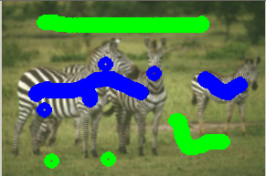

# svm-GraphCut
Interactive user marked segmentation with GraphCuts.

# Details
1. Segmentation algorithm uses Support Vector Machine and Boykov GraphCut to grow user marked pixels into foreground and background regions.

2. Available in MATLAB and Python.
  * MATLAB requires CVX and Maxflow library
  * Python requires sklearn and PyMaxflow

3. Implemented visualization GUI for analysis and user interaction.

# Results
- Green: User marked background.
- Blue: User marked foreground

 

 

 

Note: Marking with Python GUI

### TODO:
[] Jaccard Similarity on BSD.
[] Clean.
